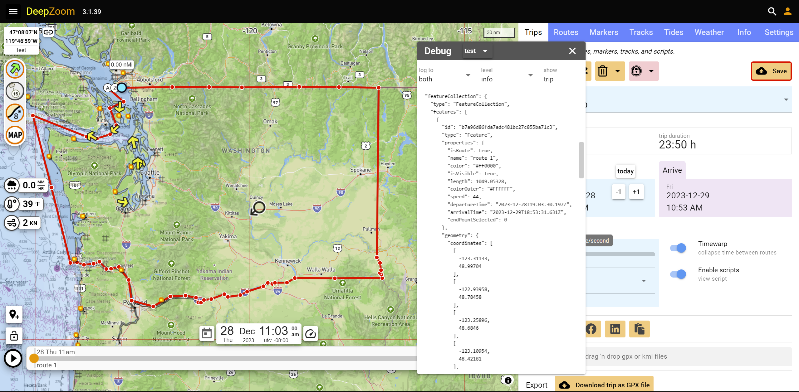

# tilepyramidcut

## Description

A Python utility which prunes or copies files from an image tile pyramid.  The region to be deleted or copied is defined by one or more geojson polygons. Any tiles which lie on or within the polygon(s) will be copied or pruned.  Here's a good definition of a tile pyramid and the concepts involved: 

[https://www.maptiler.com/google-maps-coordinates-tile-bounds-projection](https://www.maptiler.com/google-maps-coordinates-tile-bounds-projection)

- The area to be pruned or copied can be defined by a geojson `LINESTRING` or `POLYGON`. <br/>Or you can
use a [DeepZoom](https://www.deepzoom.com) trip containing one or more routes which are automatically closed to define the Polygon(s).
- Available operations are:
  - **Prune**: remove tiles within the Polygon bounds
  - **Copy**: duplicaate tiles with the Polygon bounds to the `--dst` directory. Any existing tiles in the destination directory
  will be silently overwritten.
- You can specify the range of zoom levels to be pruned or copied.
- You can specify the source and destination directories.
- Warning: Does not handle interior Polygons (Polygon inside another Polygon).

## Installation

Warning: installation includes [proj](https://github.com/OSGeo/PROJ) which is not a picnic to install.  I'd start with a new environment.

#### Pip
```
python3 -m venv env
source env/bin/activate
pip install -r requirements.txt
```
#### Conda
```
conda create --name <env> --file requirements.yml
```

## Usage

```
usage: tilepyramidcut.py [-h] --src SRC [--dst DST] --polyfile POLYFILE --op {prune,copy} --zbegin ZBEGIN --zend ZEND [--version]

options:
  -h, --help           show this help message and exit
  --src SRC            source directory to process
  --dst DST            destination directory for copy op
  --polyfile POLYFILE  json file containing geojson geometry of Polygon(s) to prune or copy
  --op {prune,copy}    the operation to perform
  --zbegin ZBEGIN      start zoom
  --zend ZEND          end zoom 
  --version            show program's version number and exit
```

### Example

Imagine there is a pre-existing tile pyramid of NOAA natical charts in `C:/charts/noaa.feet`, and the we wish to copy only those tiles within the state of Washington and between zoom 3 and zoom 9 (inclusive).  In [DeepZoom](https://www.deepzoom.com) (or any utility which produces geojson), create the boundary file and call it "washington.json".  

Then, to perform the copy:

```
python tilepyramidcut.py --src /charts/USA/noaa.feet/ --dst /charts/out/ --op "copy" --polyfile "polygons/washington.json" --zbegin 3 --zend 9
```

Here is the Polygon definition:



If using DeepZoom to define the Polygon(s), display the trip in the Debug window as shown above.  Then double click to copy the trip to the clipboard.

## Credits

The heavy lifting is done by [tilematrix](https://github.com/ungarj/tilematrix).

## License

MIT.

## Tests

Nope.